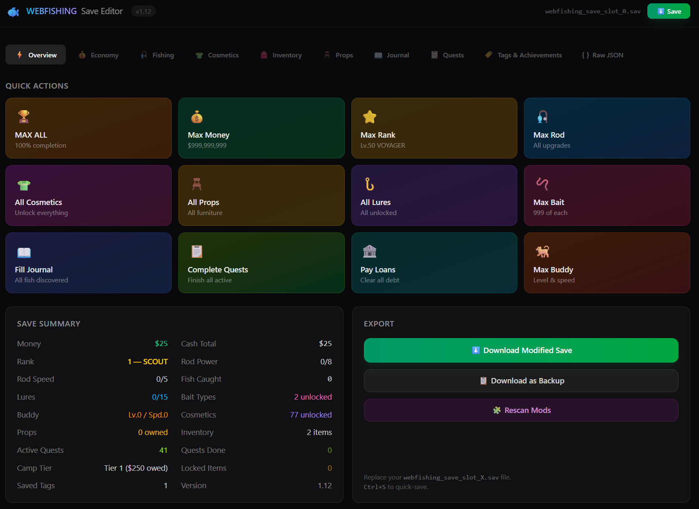

<div align="center">

# 🐟 WEBFISHING Save Editor

**A premium web-based save editor for [WEBFISHING](https://store.steampowered.com/app/3146520/WEBFISHING/) — edit everything, break nothing.**

Built with SvelteKit · TypeScript · Tailwind CSS

[](https://store.steampowered.com/app/3146520/WEBFISHING/)
[](https://kit.svelte.dev/)
[](#license)

</div>

---



## ✨ What is this?

A fully-featured save editor that runs in your browser. Load your `webfishing_save_slot_X.sav` file, edit anything you want, and download the modified save. No installs, no sketchy executables — just a clean web app.

Supports **vanilla game data** and **modded content** (auto-detected).

---

## 🚀 Features

### ⚡ Quick Actions (Overview Tab)
One-click buttons to instantly max out your entire save:
- **MAX ALL** — 100% completion in one click
- **Max Money** · **Max Rank** · **Max Rod** · **Max Bait** · **Max Buddy**
- **All Cosmetics** · **All Props** · **All Lures**
- **Fill Journal** · **Complete Quests** · **Pay Loans**
- **Save Summary** dashboard with full stats at a glance
- **Export** — download modified save, backup, or quick-save with `Ctrl+S`

### 💰 Economy
- Edit current money & lifetime earnings with quick presets ($1k–$999M)
- Manage camp loans — view all 4 tiers, pay off debt, edit balances

### 🎣 Fishing
- Level & XP editor (Lv.1–50 with accurate rank titles)
- Rod upgrades — Power, Speed, Chance, Luck with cost tracking
- Buddy level & speed editor
- Lure manager with icons, descriptions, and unlock toggles
- Bait manager — quantities, unlock states, quick max buttons
- Voice pitch & speed tuning

### 👗 Cosmetics
- Browse all 385+ cosmetics across 15 categories
- Filter by source: Chest, Quest, Rank, Shop, Modded
- Bulk unlock/lock by source type
- Equipped cosmetics editor with dropdown selectors
- Dev cosmetics toggle for hidden items

### 🎒 Inventory
- Full item catalog with 168+ items in a visual grid
- Click-to-add, right-click-to-remove
- Per-item quality picker (Normal → Alpha), size slider, lock toggle
- Hotbar slot editor (5 slots)
- Source filters: Normal, Unobtainable, Modded

### 🪑 Props (Furniture)
- Visual prop catalog — add/remove with click
- Quantity & quality editor per prop
- Bulk add all / remove all

### 📖 Journal
- 7 fishing zones with progress bars (Lake, Ocean, Rain, Trash, Alien, Void, Deep Sea)
- Per-fish: caught count, record size, 6-tier quality toggle (✦ diamond buttons)
- Realistic data generation — auto-fills with weighted randomness
- Search, preserve mode, zone-level fill/clear

### 📜 Quests
- Browse all active quests with tier badges (Common → Legendary)
- Progress slider + number input per quest
- Reward preview: gold, XP, cosmetic unlocks
- Complete All / Reset All bulk actions
- Completion properly syncs with save summary

### 🏷️ Tags & Achievements
- 10 known tags with descriptions
- 16 Steam achievements with auto-detection from save data
- Custom tag support — add your own
- Bulk unlock/clear

### `{ }` Raw JSON
- VS Code Dark+ themed syntax-highlighted editor
- Live validation with error reporting
- Format, minify, copy-to-clipboard toolbar
- Stats dashboard: line count, properties, file size
- Full read/write access to the raw save structure

---

## 🛠️ Getting Started

### Prerequisites

- [Node.js](https://nodejs.org/) 18+ **or** [Bun](https://bun.sh/) (recommended — faster installs & builds)

### Install & Run

```bash
# Clone the repo
git clone https://github.com/cry4pt/webfishing-save-editor.git
cd webfishing-save-editor

# Install dependencies (pick one)
bun install    # recommended
npm install    # also works

# Start dev server
bun run dev    # or: npm run dev
```

Open [http://localhost:5173](http://localhost:5173) in your browser.

### Build for Production

```bash
bun run build    # or: npm run build
```

Output goes to `build/` — static files you can host anywhere.

### Preview Production Build

```bash
bun run preview    # or: npm run preview
```

Opens at [http://localhost:4173](http://localhost:4173) — serves the production build locally so you can test before deploying.

### Extract Game Data

If you have the game's decompiled source, you can regenerate the game data:

```bash
bun run extract    # or: npx tsx src/lib/extractor.ts
```

---

## 📁 Save File Location

Your Webfishing save files are at:

```
Windows:  %APPDATA%\Godot\app_userdata\webfishing_2_newver\
```

Look for `webfishing_save_slot_0.sav`, `webfishing_save_slot_1.sav`, etc.

---

## 🔧 Tech Stack

| Layer | Tech |
|-------|------|
| Framework | [SvelteKit](https://kit.svelte.dev/) (Svelte 5) |
| Language | TypeScript |
| Styling | Tailwind CSS 4 |
| Build | Vite |
| Runtime | Bun / Node.js |
| Save Format | Godot `store_var()` binary codec (custom decoder) |

---

## 🤝 Contributing

PRs welcome! The codebase is organized as:

```
src/lib/
├── components/     # Tab components (OverviewTab, FishingTab, etc.)
├── godot/          # Binary codec & converter for Godot save format
├── gamedata.ts     # Game constants, formulas, manual data
├── gamedata-extracted.ts  # Auto-generated from game source
├── extractor.ts    # Unified extraction (vanilla + mods + Vite plugin)
└── save.svelte.ts  # Reactive save state management
```

---

## 📜 License

MIT — do whatever you want with it.

---

<div align="center">

**Made for the WEBFISHING community** 🐟

</div>
